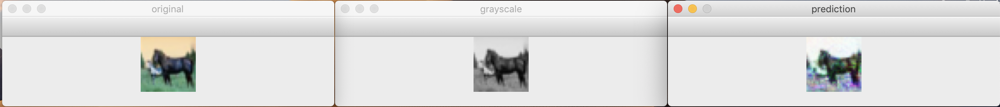
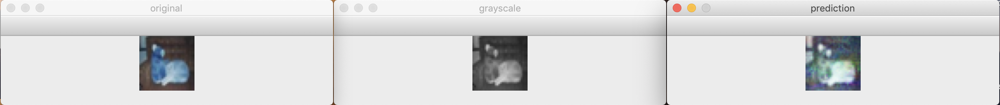
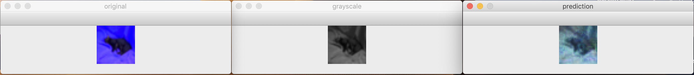
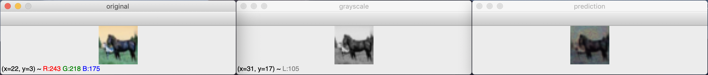
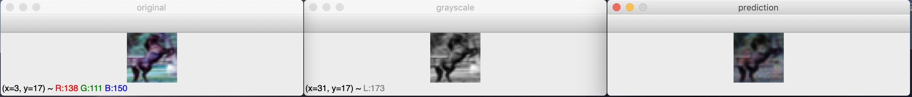
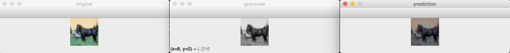
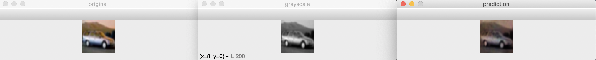
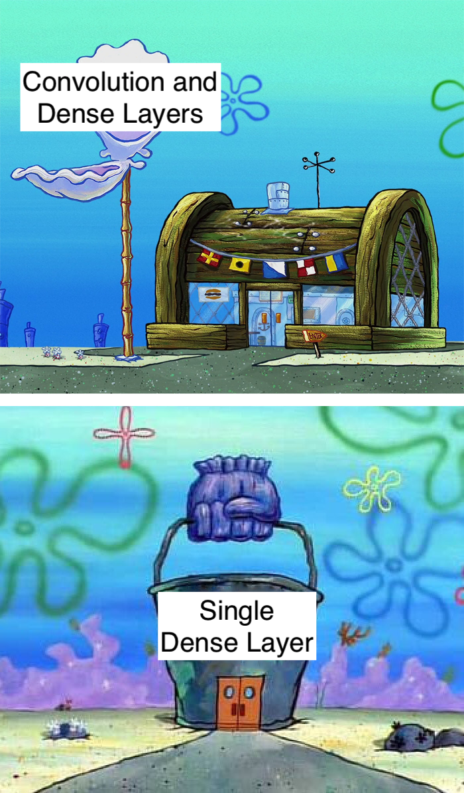
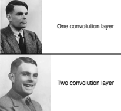

# colorize-cnn

A convolutional neural network to colorize grayscale images.

Author: Hank Sheehan

---

## Abstract
This project is to explore the possibilites of colorizing grayscale images using convolutional neural network. There should be an input of a grayscale image of any dimension and an output of an RGB image of the same dimension, representing the grayscale image in color.

## Overview
The neural network is created with Python using the [Keras](https://keras.io/) framework on top of [TensorFlow](https://www.tensorflow.org/).

## Dataset
The dataset used is the [CIFAR-10](https://www.cs.toronto.edu/~kriz/cifar.html) dataset.

## Setup

### Hardware
This model will trained on my 13-inch Macbook with no GPU, so let's see how it goes ¯\\\_(ツ)\_/¯.

The specs of the machine used are the following:
- **CPU**: 2.3 GHz Intel Core i5
- **Memory**: 16 GB 2133 MHz LPDDR3
- **Graphics**: Intel Iris Plus Graphics 640 1536 MB (not compatible with TensorFlow)
- **Model**: MacBook Pro (13-inch, 2017, Two Thunderbolt 3 ports)

## Results
### Loss function
For the loss function I decided to use cross entropy. This is because cross entropy tends to work out well for multi-class classifiers. If we think about this problem, we are essentially trying to classify each pixel from zero to 16777216 (256 for each color channel). Since I am using a dataset of 32x32 images, there are 1024 pixels, each with 3 values of 256 to classify.

### Architecture

#### Flatten -> Dense
I began with a single dense layer. In order to have the dense layer work with a 32 by 32 by 1 image (32x32, 1 grayscale channel), I had to flatten the image to a 1024 length array. This dense layer would output a 3072 length array, 3 values for each pixel. This was a good starting place since it got me used to normalizing the images and training a network in this way. The results look good for a neural network that is essentially just mapping a single channel to three channels without any context.

For these images I used a batch size of 32 and 10 epochs of learning. The accuracy was 1%.

So how does a single dense layer stack up?

#### Convolution -> Flatten -> Dense
The next step was to add a convolution layer to give the neural network context. I decided to begin with a kernal of 3x3 since that seemed quick to train and a relatively big size (context-wise) for a 32x32 image. Running this on the batch size of 32 and 10 epochs took about 30 minutes and gave an accuracy of around 3% (3 times better!).

The images turned out to be relatively promising. Although the output images are not super close to the original images, they are colored similarly to how a human might mistakenly color them. For instance, the dark blue truck is colored dark red and the sky about the horse in the first image is a blue hue.

#### Convolution -> Batch Normalization -> Convolution -> Flatten -> Dense
The convolution layer was looking pretty good, but I wanted to add another convolution. I was thinking that another convolution with a really large amount of filters would allow for the neural network to see more features (building a bigger feature map). I added batch normalization in between the convolution layers to speed things up. I decided to use different activation functions for them as well: ReLU to help out with any features that would be pretty constant colors and sigmoid to handle more non-linear classifiers. The accuracy was pretty good: over 6%!

I was actually pretty blown away by how this one turned out. Way better than I could have colorized these images by hand. The training only took about 30 minutes on my dual core CPU.

When comparing this to my last architecture, this is exactly what I was expecting. The backgrounds and things without many features are colored a lot more consistently with the addition of a ReLU convolution layer. However, the color is a little washed out when re-colorizing.

#### Training it for hours and hours
For the final experiment, I tried training the last architecture for 100 epochs. This is 10 times the training time I gave the last model, so I was hoping the 5 hour run paid off.

## Conclusion
To sum up what I've learned from this little project:

