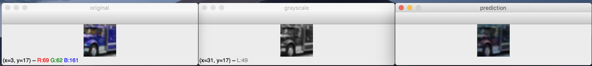

# colorize-cnn
A convolutional neural network to colorize grayscale images.

## Abstract
This project is to explore the possibilites of colorizing grayscale images using convolutional neural network. There should be an input of a grayscale image of any dimension and an output of an RGB image of the same dimension, representing the grayscale image in color.

## Overview
The neural network is created with Python using the [Keras](https://keras.io/) framework on top of [TensorFlow](https://www.tensorflow.org/).

## Dataset
The dataset used is the [CIFAR-10](https://www.cs.toronto.edu/~kriz/cifar.html) dataset.

## Setup

## Hardware
This model will trained on my 13-inch Macbook with no GPU, so let's see how it goes ¯\\\_(ツ)\_/¯.

The specs of the machine used are the following:
- **CPU**: 2.3 GHz Intel Core i5
- **Memory**: 16 GB 2133 MHz LPDDR3
- **Graphics**: Intel Iris Plus Graphics 640 1536 MB (not compatible with TensorFlow)
- **Model**: MacBook Pro (13-inch, 2017, Two Thunderbolt 3 ports)

## The Experiment
### Flatten -> Dense
I began with a single dense layer. In order to have the dense layer work with a 32 by 32 by 1 image (32x32, 1 grayscale channel), I had to flatten the image to a 1024 length array. This dense layer would output a 3072 length array, 3 values for each pixel. This was a good starting place since it got me used to normalizing the images and training a network in this way. The results look good for a neural network that is essentially just mapping a single channel to three channels without any context.

For these images I used a batch size of 32 and 10 epochs of learning. The accuracy was 1%.

### Convolution -> Flatten -> Dense
The next step was to add a convolution layer to give the neural network context. I decided to begin with a kernal of 3x3 since that seemed quick to train and a relatively big size (context-wise) for a 32x32 image. Running this on the batch size of 32 and 10 epochs took about 30 minutes and gave an accuracy of around 3% (3 times better!).

The images turned out to be relatively promising. Although the output images are not super close to the original images, they are colored similarly to how a human might mistakenly color them. For instance, the dark blue truck is colored dark red and the sky about the horse in the first image is a blue hue.

### Batch Normalization -> Convolution -> Flatten -> Dense
The convolution layer was looking pretty good, but I wanted to speed it up. Maybe then I could add more epochs or layers with the limited training time that my patience allowed.

## Results
